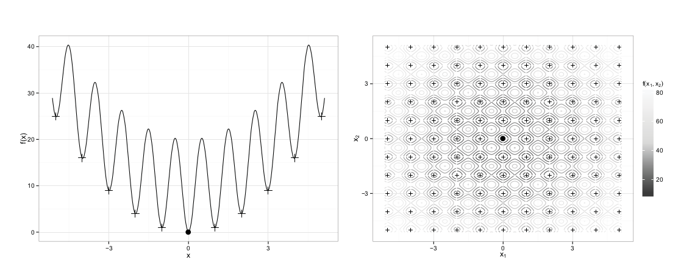

## Introducción

En este poyecto final vamos a tratar la metaheurística **Leaders and Followers**, que está enmarcada en el contexto de algoritmos que pretenden encontrar buenas soluciones en espacios de más de una dimensión. 

La filosofía principal que sigue la metaheurística es que para lograr buenas soluciones en espacios n-dimensionales es más importante que la **exploración** (generación de soluciones en otros entornos distintos al de inicio) sea eficaz prevalezca sobre la **explotación** (la capacidad de aproximar con precisión un extremo local dado un entorno del espacio de búsqueda). 

Siguiendo esta filosofía vamos a necesitar el concepto de **región de atracción**, que es una región del espacio de búsqueda en la cual se encuentran todos los posibles puntos de inicio que cuando aplicamos **búsqueda Local** u otro algoritmo dan como resultado un extremo local particular. Dicho de otra forma, sería regiones del espacio de búsqueda que nos garantizan que al iniciar el algoritmo en ellas en cualquier punto, conseguimos aproximar un extremo local concreto.

## Motivación

Para explicar la motivación del algoritmo nos podemos fijar en el ejemplo concreto de la función de Rastrigin en una y dos dimensiones, definida por la expresión: 

$$f(x)=10n + \sum_{i=1}^n [(x_i)^2-10cos(2\pi x_i)]$$

Dónde $n$ indica la dimensión y $x_i \in [-5.12,5.12]$. 

La función alcanza su mínimo global en el valor $x=0$ con $f(x)=0$, pero tiene muchos otros extremos locales en el espacio de búsqueda. Como vemos los regiones de atracción serían las regiones que rodean los extremos locales.

Fijándonos en esta función, podríamos obtener una medida de lo *alta* que está una posible solución dentro de un **región de atracción** calculando la diferencia entre el fitness de la solución y el valor del óptimo local. El problema de la **explotación** en este caso puede ser sencillo, pues los regiones de atracción son convexos, lo que resulta más complicado es la **exploración**, es decir, saltar a otras regiones de atracción *mejores*.

Con esta intuición se realizó un experimento en el cual se concluyó que si tenemos una solución en un región de atracción que aproxima muy bien su correspondiente extremo local y generamos nuevos valores aleatorios en el espacio de búsqueda y los comparamos con dicha solución, las conclusiones que saquemos estarán sesgadas por el conocimiento que tengamos del región de atracción de la solución inicial, y no solo eso, sino que cuanto más optimizada esté esta solución, más complicado será saltar a otra región de atracción, pues la diferencia entre la solución inicial y el extremo local que aproxima será muy pequeña. 

En resumen, si en algún punto del experimento se aproxima muy bien un extremo local, resulta muy dificil saltar a otro región de atracción con un extremo mejor, por lo que nos da a entender que las metaheurísticas que comparan en cada iteración las soluciones nuevas generadas con el mejor actual podrían caer en este mismo problema. Para evitar esto surge el algoritmo que explicamos en la siguiente sección.

## Algoritmo Líderes y Seguidores

Como resultado del experimento anterior, el algoritmo pretende cumplir las siguientes premisas: 

- No se va a realizar comparación directa entre los elementos generados para exploración y la mejor solución actual. 
- Se parte de la premisa de que la exploración entre regiones de atracción es más insesgada al comienzo del algoritmo, en las primeras iteraciones.

El principal argumento que secunda el primer principio es que la mejor solución actual será muy próxima al extremo local que aproxima, y por esto, las muestras de soluciones de una región de atracción raramente estarán tan cerca al extremo local como la mejor solución conocida.

En cambio, el principal argumento del segundo principio es que la *altura* en las regiones de atracción cae muy rápidamente si usamos una búsqueda aleatoria uniforme, por eso, al comienzo del algoritmo es cuando se dan las mejores condiciones para comparar entre regiones de atracción.

### Diseño de la metaheurística

Para cumplir con estos dos principios, el algoritmo **Líderes y Seguidores** propone emplear dos poblaciones separadas, la primera se denomina *Líderes* y la segunda *Seguidores*. El conjunto de Líderes mantiene las mejores soluciones encontradas por el algoritmo hasta el momento, mientras que el segundo se encargará de la búsqueda de nuevas soluciones.

Esta separación en dos poblaciones nos permite cumplir el primer principio, pues las nuevas soluciones que generen los Seguidores serán comparadas con las demás soluciones en el conjunto de Seguidores, sin que haya interacción con ninguna solución en el conjunto de Líderes. La población de los Líderes por su parte se actualizará con las soluciones de los Seguidores solo después de que se hayan realizado las búsquedas suficientes en el contexto de los seguidores.